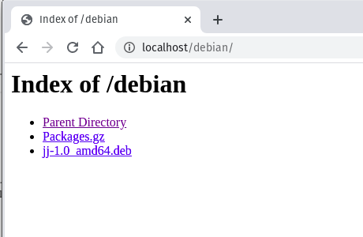
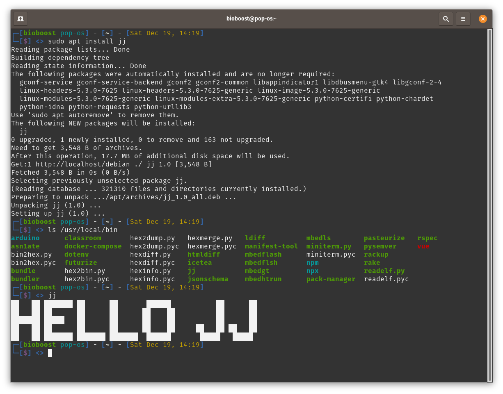

# Hello JJ

## Build the Source

Build the source (not the one of the matrix but the application):

```bash
make
```

Generates a binary in `./bin`.

## Creating a Debian package

Create a directory for the package:

```bash
mkdir jj
```

Create the `DEBIAN` dir and inside a file called `control`:

```bash
mkdir jj/DEBIAN
touch jj/DEBIAN/control
```

The control file describes the package. Alter the content below and put it in the control file:

```text
Package: jj
Version: 1.0
Section: custom
Priority: optional
Architecture: all
Essential: no
Installed-Size: 1024
Maintainer: jj.thegreat.com
Description: Its like steam locomotive but without the steam and locomotive

```

**Make sure to include the empty newline, cause yeah, its like linux. At least a missing newline doesn't create a blue-screen.**

Next create a directory tree inside the `jj` dir which represents the path where our program will be installed in the system. Copy the executable binary to the created subdir.

```bash
mkdir -p jj/usr/local/bin
cp jj_source/bin/jj jj/usr/local/bin
```

You can basically put anything in the package: libraries, man-pages, binaries, ... except for Chuck Norris. Can't package the Chuck.

Time to take of and build the debian package

```bash
dpkg-deb --build jj
```

Should result in *dpkg-deb: building package 'jj' in 'jj.deb'.*. Now you should have a `jj.deb` package file.

Apparently it's also a good idea to rename the deb file to reflect the version and arch (which will probable be ARM for the PI):

```bash
mv jj.deb jj-1.0_amd64.deb
```

## Generating a Package List

First create a directory for the package(s).

```bash
mkdir -p jjs_packages/debian
mv *.deb jjs_packages/debian/
```

Now we just need to generate the package list:

```bash
cd jjs_packages/debian
dpkg-scanpackages . | gzip -c9  > Packages.gz
```

If the `dpkg-scanpackages` tool is not available, install it using `sudo apt install dpkg-dev`.

## Serving the Packages

Basically you can host the packages on an ftp-server or web-server.

I'm gonna use docker here, but any web-setup is ok.

Since it's a test setup a temporary image will suffice:

```bash
docker run -it --rm -p 80:80 -v "$PWD/jjs_packages":/usr/local/apache2/htdocs/ httpd:2.4
```

You can actually test it out by surfing to [http://localhost](http://localhost). You should see:



If you are done with the web-server, just `CTRL-C` it the hell out of here.

## Install Time

Next your package repository needs to be added to the system where you wish to install the package on (only needs to be done once).

```bash
sudo su
echo "deb [trusted=yes] http://localhost/debian ./" | tee -a /etc/apt/sources.list > /dev/null
```

Of course the `localhost` needs to be replaced with an actual accessible public domain.

Updating the local package repositories

```bash
sudo apt update
```

should also include your package repo:

```text
...
Ign:1 http://localhost/debian ./ InRelease
Ign:2 http://localhost/debian ./ Release
Ign:3 http://localhost/debian ./ Packages
Ign:4 http://localhost/debian ./ Translation-en
...
```

And now you should be able to install your package:

```bash
sudo apt install jj
```

And like Borat would say: **Great Success**:



## Based on

This fella's guide: [https://linuxconfig.org/easy-way-to-create-a-debian-package-and-local-package-repository](https://linuxconfig.org/easy-way-to-create-a-debian-package-and-local-package-repository).
